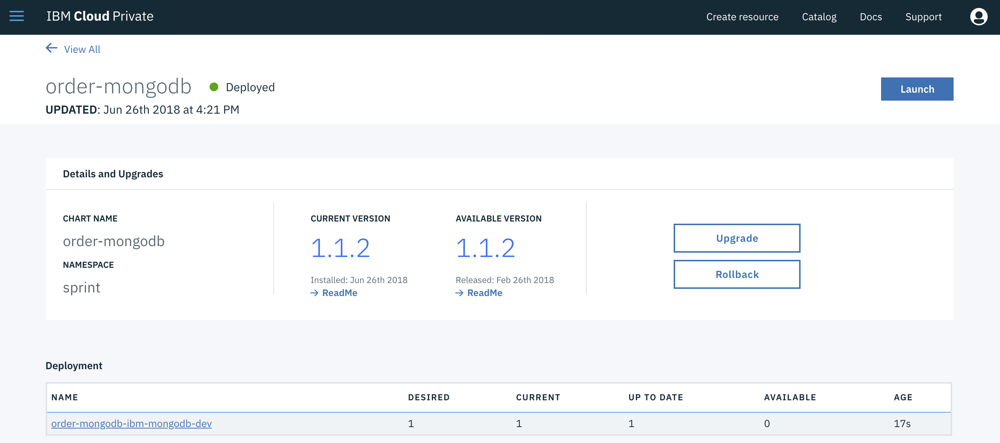
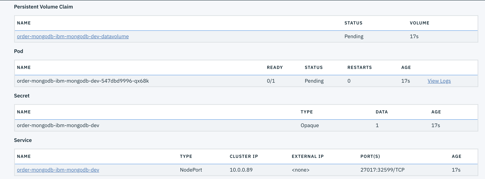

# Spring cloud adoption proof of concept

This application built using Spring Boot (web socket connection) , MongoDB , ActiveMQ , Maven
WebSocketService.java is RestController
/confirm-order is the API path
When API receives the request , writing the POST request object to order-details-queue.
And order-details-queue has a listener logic in Listener.java , where we're calling backend API and based on the response writing to a topic or storing into Mongo DB.

## Build
As we have still issue in testing

```
$ mvn clean package -Dmaven.test.skip=true
```

### run
```
$ mvn exec:java@order
```

## Deploy to IBM Cloud Private
From the code IBM team received we did:
* develop a pom.xml to use maven to compile and package. We add dependencies for mongo, activeMQ, spring messaging.
* add a Dockerfile to be able to start the Springboot app
* Modify the code to get parameter from application.properties specially for mongo db. So we added a class MongoConfiguration, and the @Value annotation.
```java
@EnableMongoRepositories
public class MongoConfiguration {
	 @Value("${spring.data.mongodb.host}")
	    protected String mongoHost;

	    @Value("${spring.data.mongodb.port}")
	    protected String mongoPort;

	    @Value("${spring.data.mongodb.database}")
	    protected String mongoDB;

	    @Bean
		public MongoTemplate mongoTemplate() throws Exception {
			return new MongoTemplate(new MongoClient(mongoHost,Integer.parseInt(mongoPort)),mongoDB);
		}
}
```
The application.properties file is defined in the helm deployment.

* deploy mongodb chart into ICP
* specify the mongo parameters in the application.properties
* create a unit test to test mongo repository access.

### Mongodb deployment
Use the ICP catalog to deploy the Helm release. The `configure` wizard drives the configuration. We selected dynamic provisioning for Persistence Volume.





What is important to get is the URL for the service. The service is NodePort type. The DNS inside the cluster defines the following hostname: order-mongodb-ibm-mongodb-dev.sprint.svc.cluster.local the exported port number is 27017.

From those information we can connect to the database outside of kubernetes, use the commands:
```
# get password from the secret:
$ export MONGOPASSWORD=$(kubectl get secret --namespace sprint order-mongodb-ibm-mongodb-dev -o jsonpath="{.data.password}" | base64 --decode; echo)
$ kubectl run order-mongodb-ibm-mongodb-dev-client --rm --tty -i --image mongo \
    --command -- mongo order-mongodb-ibm-mongodb-dev:27017/admin -u mongo -p $MONGOPASSWORD
$ export MONGOHOST=$(kubectl get nodes --namespace sprint -o jsonpath='{.items[0].status.addresses[0].address}')
$ export MONGOPORT=$(kubectl get svc --namespace sprint order-mongodb-ibm-mongodb-dev -o jsonpath='{.spec.ports[0].nodePort}')    

$ mongo ${MONGOHOST}:${MONGOPORT}/admin -u mongo -p $MONGOPASSWORD
```
The IP address matches the kubernetes proxy address.

## Compendium
* [Springboot mongodb getting started](https://spring.io/guides/gs/accessing-data-mongodb/)
